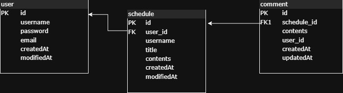

# scheduler-project-develop

## API 명세서
| 기능                | Method | URL                                             | request                                                                                                                    | response                                                                                                                                                                                        | 상태코드        |
|-----------------------|--------|--------------------------------|-------------------------------------------------------------------------------------------------------------------------------------------|------------------------------------------------------------------------------------------------------------------------------------------------------------------------------------|-------------|
| 유저 등록             | POST   | /users/signup                                      | {"username" : "bat", "password" : "12341234", "email" : "bat123@gmail.com"} | {"id":2,"username":"bat","email":"bat123@gmail.com"} | 201 CREATED |
| 로그인    | POST        | /login  | { "email" : "bat123@gmail.com", "password" : "12341234"}  | {"message": "로그인되었습니다."}  | 201 CREATED |
| 로그아웃  | POST        | /logout  |-|{"message": "로그아웃되었습니다."}  | 200 OK      |
| 일정 생성 | POST        | /schedules | {"username" : "bat", "title" : "yeah", "contents" :"yeyeye"} | {"id":2,"title":"yeah","contents":"yeyeye"} | 201 CREATED      |
| 일정 전체 조회 | GET    | /schedules | - | {"content":[{"id":2,"title":"yeah","contents":"yeyeye"},{"id":1,"title":"yeah","contents":"yeyeye"}],"pageable":{"pageNumber":0,"pageSize":10,"sort":{"empty":false,"sorted":true,"unsorted":false},"offset":0,"paged":true,"unpaged":false},"last":true,"totalPages":1,"totalElements":2,"first":true,"numberOfElements":2,"size":10,"number":0,"sort":{"empty":false,"sorted":true,"unsorted":false},"empty":false}   | 200 OK      |
| 일정 id로 조회 | GET    | /schedules/{id} | id (Long) - 일정 ID | {"id":1,"title":"yeah","contents":"yeyeye"} | 200 OK |
| 일정 id로 수정 | PUT    | /schedules/{id} | id (Long) - 일정 ID, {"username" : "bat", "title" : "yeah", "contents" :"yeyeye"} | {"id":1,"title":"yeah","contents":"yeyeye"} | 200 OK      |
| 일정 id로 삭제 | DELETE | /schedules/{id} | id (Long) - 일정 ID | {"message":"일정이 삭제되었습니다."}  | 200 OK |
| 유저 전체 조회 | GET    | /users  | - | [{"username":"bat","email":"bat123@gmail.com"},{"username":"cat","email":"cat123@gmail.com"}] | 200 OK |
| 유저네임으로 조회  | GET    | /users/{username} | username (String) - 유저 이름 | {"username":"cat","email":"cat123@gmail.com"} | 200 OK |
| 유저 패스워드 수정 | PATCH  | /users/{id} | id (Long) - 유저 ID, {"oldPassword":"12341234","newPassword":"12345678"} | {"message":"패스워드가 변경되었습니다."} | 200 OK |
| 유저 id로 삭제     | DELETE | /users/{id} | id (Long) - 유저 ID | {"message":"유저가 삭제되었습니다."}  | 200 OK |
| 댓글 생성 | POST        | /schedules/{scheduleId}/comments | id (Long) - 일정 ID, {"username" : "bat","contents" : "hellyeyeye"} | {"contents":"hellyeyeye","id":14,"scheduleId":1} | 201 CREATED   |
| 일정 id로 일정에 달린 댓글 전체 조회 | GET | /schedules/{scheduleId}/comments | id (Long) - 일정 ID | [{"contents":"hellyeyeye","id":1,"scheduleId":1},{"contents":"hellyeyey1e","id":2,"scheduleId":1},{"contents":"hellyeyey12e","id":3,"scheduleId":1},{"contents":"hellyeyey123e","id":4,"scheduleId":1},{"contents":"hellyeyey1234e","id":5,"scheduleId":1}] | 200 OK |
| 댓글 id로 조회 | GET    | /comments/{id} | id (Long) - 댓글 ID | {"contents":"hellyeyeye","id":1,"scheduleId":1} | 200 OK |
| 댓글 전체 조회 | GET    | /comments | - | {"content":[{"contents":"hellyeyeye112233","id":17,"scheduleId":1},{"contents":"hellyeyeye1122","id":16,"scheduleId":1},{"contents":"hellyeyeye11","id":15,"scheduleId":1},{"contents":"hellyeyeye","id":14,"scheduleId":1},{"contents":"hellyeyey123456789012e","id":13,"scheduleId":1},{"contents":"hellyeyey12345678901e","id":12,"scheduleId":1},{"contents":"hellyeyey1234567890e","id":11,"scheduleId":1},{"contents":"hellyeyey123456789e","id":10,"scheduleId":1},{"contents":"hellyeyey12345678e","id":9,"scheduleId":1},{"contents":"hellyeyey1234567e","id":8,"scheduleId":1}],"pageable":{"pageNumber":0,"pageSize":10,"sort":{"empty":false,"sorted":true,"unsorted":false},"offset":0,"paged":true,"unpaged":false},"last":false,"totalPages":2,"totalElements":17,"first":true,"numberOfElements":10,"size":10,"number":0,"sort":{"empty":false,"sorted":true,"unsorted":false},"empty":false} | 200 OK |
| 댓글 id로 수정 | PATCH  | /comments/{id} | id (Long) - 일정 ID, {"username" : "bat","contents" : "hellyeyeye"} | {"username" : "bat","id":5,"contents" : "hellyeyeye"} | 200 OK      |
| 댓글 id로 삭제 | DELETE | /comments/{id} | id (Long) - 일정 ID | {"message":"댓글이이 삭제되었습니다."}  | 200 OK |

##  ERD 

